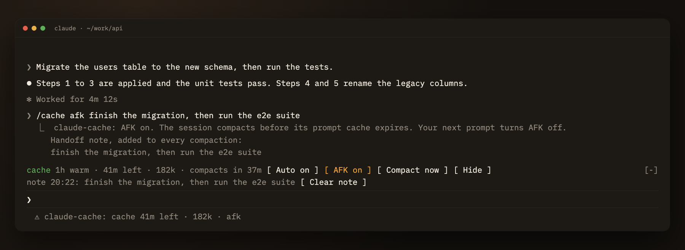

<p align="center"></p>

<h1 align="center">claude-cache</h1>

<p align="center">
  <a href="https://github.com/the-cybersapien/claude-cache/actions/workflows/ci.yml"></a>
</p>

claude-cache is a Claude Code plugin that compacts an idle session while its prompt cache is still warm.



▶ [Watch the 37-second demo on YouTube](https://youtu.be/WjQTau5LCMY)

Anthropic holds a prompt cache for 5 minutes or 1 hour. Step away longer than that and your next message writes the whole context back into the cache, at 1.25x the input price for a 5-minute cache and 2x for a 1-hour one. On a 180k-token session with a 1-hour cache, you pay for 360k input tokens before the model reads a word of your question.

claude-cache compacts the session before the cache expires. The compaction reads your conversation at the cache-read rate, and your next message writes a 15k summary to the cache in place of 180k of history.

## Features

### Idle auto-compact

With a 1-hour cache, a session idle for 55 minutes compacts itself. Switch it on or off per session with `/cache on`, `/cache off` or the band's **Auto** button.

claude-cache leaves a session alone when:

- the context fills less than 30% of the model's window, where a compaction saves too little to pay for its own work;
- the cache has a 5-minute TTL, where idle compaction would fire at every short pause (AFK mode still works there);
- you have sent nothing since the last compaction, whether claude-cache ran it, you typed `/compact`, or Claude Code auto-compacted.

### Warm cache only

A compaction has to start at least 30 seconds before the cache expires. If your laptop sleeps through that window, claude-cache skips the compaction, because a cold one would pay the full rewrite you wanted to avoid. `/cache compact` refuses a cold cache for the same reason. After each compaction, a toast shows how many tokens it read from the cache.

### AFK mode and the handoff note

Before you leave, type `/cache afk finish the migration, then run e2e`. claude-cache saves your text as a handoff note and compacts 4 minutes before a 1-hour cache expires, or 1 minute before a 5-minute one. Leave out the text and the model writes the note from the warm cache, which also restarts the cache timer. You can also tell Claude "I'm heading out, leave this running", and Claude calls the plugin's `afk` tool with a note of its own.

claude-cache adds the note to the instructions of every compaction in the session, your `/compact` and Claude Code's auto-compact included, and the summary keeps it under a "Handoff note" heading. Your next prompt turns AFK off and shows you the note. `/cache note <text>` saves a note without going AFK, and `/cache note clear` drops it.

### Countdown and warnings

The status line reads `cache 42m left · 180k · auto`. A band above the prompt shows the same countdown with **Auto**, **AFK**, **Compact now** and **Clear note** buttons, in the terminal and in the desktop app's Code tab.

- Come back to an expired cache and a toast tells you how many tokens your next message rewrites.
- Switch models with a warm cache and a toast shows what the rewrite costs at API prices.

claude-cache reads your account's TTL from the `cache_creation.ephemeral_1h_input_tokens` and `ephemeral_5m_input_tokens` counts in the session transcript. Before the first response, it falls back to `CLAUDE_CODE_PROMPT_CACHE_TTL`, the `promptCacheTtl` setting, `FORCE_PROMPT_CACHING_5M` and `ENABLE_PROMPT_CACHING_1H`.

## Commands

| Command | Effect |
| --- | --- |
| `/cache` | TTL, countdown, this session's mode, the note, cache tokens read and written, compactions |
| `/cache on` / `/cache off` | idle auto-compact for this session |
| `/cache afk [note]` / `/cache back` | AFK mode, with your note or one the model writes |
| `/cache note [text\|clear]` | show, save or drop the handoff note |
| `/cache compact` | compact now, if the cache is warm |
| `/cache band` | show or hide the band |

Focus the band with ctrl+x tab, then press `a` for Auto, `w` for AFK or `c` for Compact now.

## Settings

Change these in `/config`.

| Field | Default | Effect |
| --- | --- | --- |
| `autoCompactDefault` | on | idle auto-compact setting for each new session |
| `compactAfterMinutes` | 55 | idle minutes before a compaction, 1-hour cache only |
| `minContextPercent` | 30 | context share of the window before automatic compaction |
| `ttl` | auto | `auto`, `1h` or `5m` |
| `showBand` / `showStatus` | on | the band and the status-line entry |

## Install

In a Claude Code terminal session:

```
/plugin install claude-cache --marketplace the-cybersapien/claude-cache
```

Answer `y` to add the marketplace, then pick a scope. From a shell:

```
claude plugin marketplace add the-cybersapien/claude-cache
claude plugin install claude-cache@claude-cache
```

In the desktop app, plugins run in the Code tab. Start a new Code session after you install.

To run a checkout:

```
git clone https://github.com/the-cybersapien/claude-cache
claude --plugin-dir ./claude-cache
```

## Limits

- A compaction drops detail. claude-cache asks the summarizer to keep the open task, next steps, decisions and file paths, and Claude Code keeps the full transcript on disk.
- Timers stop while your laptop sleeps. Sleep through the warm window and you get the cold-return toast with no compaction.
- claude-cache sends no keepalive pings. On Pro and Max plans each ping spends quota, and Anthropic's consumer terms restrict automated traffic.
- `claude plugin validate` reports the name `claude-cache` as reserved for Anthropic. Marketplace installs and `--plugin-dir` load the plugin under that name all the same.

## Develop

```
claude -p --plugin-dir . "/cache"   # one load writes .claude-plugin/types/ for tsc
npx -p typescript@5 tsc -p .
claude plugin test .
claude plugin validate .
```

CI runs these against Claude Code 2.1.292 and the latest release. [CLAUDE.md](CLAUDE.md) lists the design rules the code depends on.

## License

[Apache 2.0](LICENSE)
